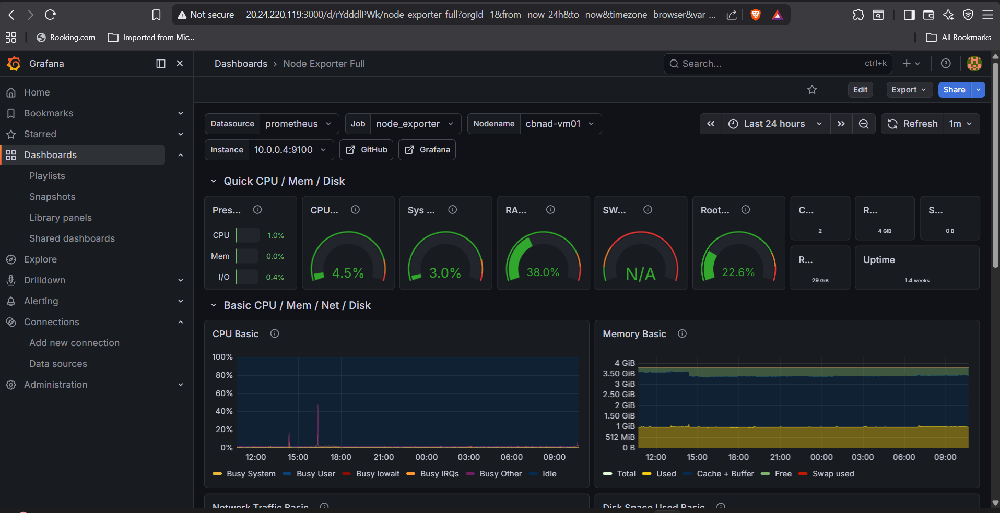
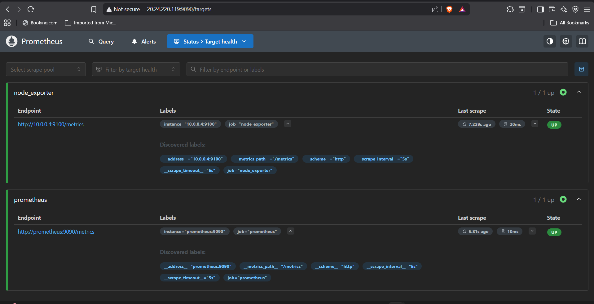
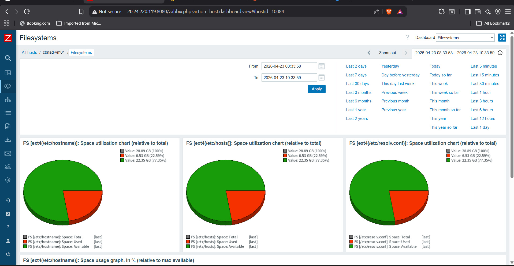
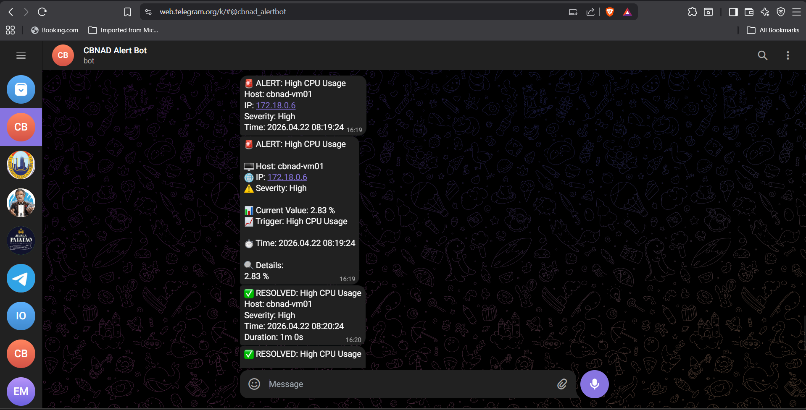
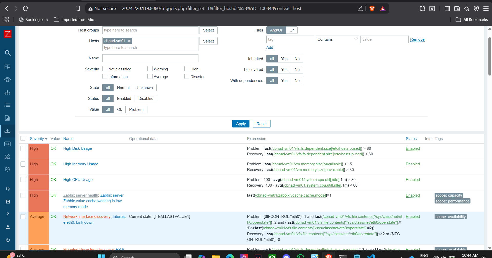
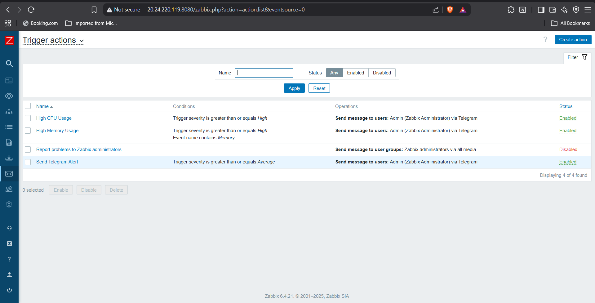
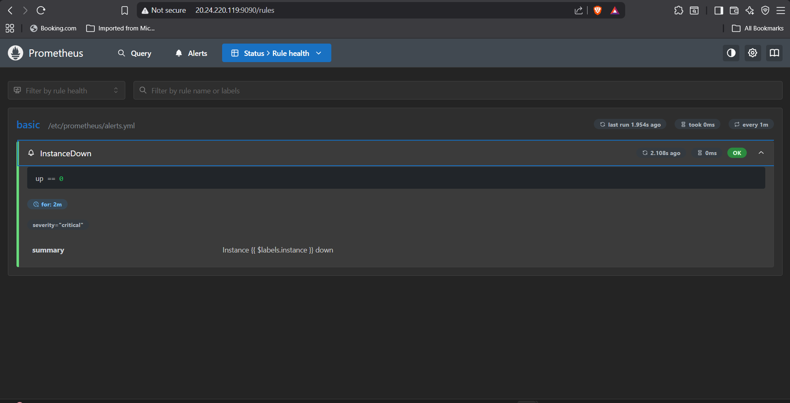

# 🚀 Cloud-Based Monitoring & Anomaly Detection (Terraform + Azure + Ansible)

## 📸 System Preview

### Grafana Dashboard


### Prometheus Targets


### Zabbix Monitoring


### Telegram Alert System


---

## 📌 Project Overview

This project implements a **cloud-based monitoring and anomaly detection system** deployed on Microsoft Azure using **Terraform for infrastructure provisioning** and **Ansible for post-provisioning server configuration**.

The system is designed for **small-scale environments**, providing real-time monitoring, anomaly detection, and alerting without relying on expensive enterprise solutions.

The project follows a practical Cloud Engineer workflow:

- **Terraform** provisions the Azure infrastructure
- **Ansible** configures the Ubuntu VM after provisioning
- **Docker Compose** runs the monitoring stack
- **Grafana, Prometheus, Zabbix, Node Exporter, and PostgreSQL** provide monitoring, visualization, metrics collection, and alerting

---

## 🎯 Objectives

- Automate infrastructure deployment using Terraform  
- Automate server configuration and monitoring stack deployment using Ansible  
- Implement real-time monitoring for system resources  
- Detect anomalies using threshold-based triggers  
- Send real-time alerts via Telegram  
- Provide clear visualization using dashboards    

---

## 🏗️ System Architecture

### Infrastructure Layer (Terraform)
- Resource Group  
- Virtual Network  
- Subnet  
- Network Security Group  
- Public IP  
- Network Interface  
- Ubuntu Virtual Machine  

### Configuration Layer (Ansible)
- SSH-based connection to the Azure VM  
- Docker Engine installation  
- Docker Compose plugin installation  
- Monitoring directory setup  
- Deployment of monitoring configuration templates  

### Monitoring Stack (Docker Compose)
- **Zabbix** → Monitoring, triggers, and alerting  
- **PostgreSQL** → Database backend for Zabbix  
- **Prometheus** → Metrics collection with a 5-second scrape interval  
- **Grafana** → Visualization dashboards  
- **Node Exporter** → Linux system metrics  

### Automation Flow

- **Terraform** provisions the Azure infrastructure  
- **Ansible** connects to the Ubuntu VM through SSH  
- **Ansible** installs Docker and Docker Compose  
- **Ansible** deploys the monitoring stack using Docker Compose  
- **Grafana, Prometheus, Zabbix, Node Exporter, and PostgreSQL** run as containers  

---

## 🚨 Implemented Alerts

| Metric | Condition | Recovery |
|--------|----------|----------|
| CPU    | > 80%    | < 60%    |
| Memory | Threshold-based | Normal |
| Disk   | > 80% usage | < 60% |

### Features

- Real-time Telegram notifications  
- Automatic recovery alerts  
- Alert duration tracking  
- Reduced alert noise (anti-flapping logic)  

---

## 🧪 Testing & Validation

Anomalies were simulated using:

```bash
# CPU stress
stress-ng --cpu 2 --timeout 60s

# Memory stress
stress-ng --vm 1 --vm-bytes 85% --timeout 120s

# Disk stress
fallocate -l 5G testfile
```

### Results

- Alerts triggered within ~10–15 seconds
- Telegram notifications delivered instantly
- Recovery alerts confirmed system normalization
- Metrics visualized correctly in Grafana

## 📊 Monitoring & Alert Configuration

### 🔔 Zabbix Trigger Definitions


### 📩 Zabbix Alert Actions (Telegram)


### 📈 Prometheus Alert Rules


## 🤖 Ansible Automation

This project has been upgraded with Ansible to automate server configuration after Terraform provisions the Azure infrastructure.

### Role of Each Tool

| Tool | Purpose |
|---|---|
| Terraform | Provisions Azure infrastructure such as Resource Group, Virtual Network, Subnet, Network Security Group, Public IP, Network Interface, and Ubuntu VM |
| Ansible | Connects to the Azure VM through SSH and automates server configuration |
| Docker Compose | Runs the monitoring stack containers |
| Grafana | Provides monitoring dashboards |
| Prometheus | Collects metrics from Node Exporter |
| Node Exporter | Exposes Linux server metrics |
| Zabbix | Provides monitoring, triggers, and alerting |
| PostgreSQL | Database backend for Zabbix |

### Ansible Project Structure

```text
ansible/
├── ansible.cfg
├── group_vars/
│   └── monitoring.yml
├── inventories/
│   └── dev.ini
├── playbooks/
│   ├── 01-install-docker.yml
│   └── 02-deploy-monitoring.yml
└── templates/
    ├── alerts.yml.j2
    ├── docker-compose.yml.j2
    └── prometheus.yml.j2
```

### Ansible Playbooks

This project includes two Ansible playbooks that automate the server configuration and monitoring stack deployment after Terraform provisions the Azure infrastructure.

| Playbook | Purpose |
|---|---|
| `ansible/playbooks/01-install-docker.yml` | Installs Docker Engine and the Docker Compose plugin on the Azure Ubuntu VM |
| `ansible/playbooks/02-deploy-monitoring.yml` | Deploys the monitoring stack using Docker Compose |

#### 1. Docker Installation Playbook

The Docker installation playbook automates the setup of Docker on the Azure Ubuntu VM.

Automated tasks include:

- Updating the Ubuntu package index
- Installing required system packages
- Adding the Docker official GPG key
- Adding the Docker APT repository
- Installing Docker Engine
- Installing the Docker Compose plugin
- Enabling and starting the Docker service
- Verifying the Docker and Docker Compose versions

#### 2. Monitoring Stack Deployment Playbook

The monitoring stack deployment playbook automates the deployment of the containerized monitoring services.

Automated tasks include:

- Creating the monitoring directory
- Copying the Docker Compose template
- Copying the Prometheus configuration template
- Copying the Prometheus alert rules template
- Pulling the required Docker images
- Starting the monitoring stack using Docker Compose
- Displaying the running containers for verification

The Ansible automation connects to the Azure VM through SSH, applies the required configuration, and starts the monitoring services as containers.

## ⚙️ Deployment Guide

### 1. Deploy Azure Infrastructure with Terraform

Terraform is used to provision the Azure infrastructure required for this project, including the Resource Group, Virtual Network, Subnet, Network Security Group, Public IP, Network Interface, and Ubuntu Virtual Machine.

```bash
# Initialize Terraform
terraform init

# Review the infrastructure plan
terraform plan

# Deploy the infrastructure
terraform apply
```

---

### 2. Configure the Azure VM with Ansible

After the Azure VM has been provisioned by Terraform, Ansible is used to configure the server and deploy the monitoring stack.

Test Ansible connectivity to the Azure VM:

```bash
ansible all -i ansible/inventories/dev.ini -m ping
```

Install Docker and Docker Compose plugin:

```bash
ansible-playbook -i ansible/inventories/dev.ini ansible/playbooks/01-install-docker.yml
```

Deploy the monitoring stack using Docker Compose:

```bash
ansible-playbook -i ansible/inventories/dev.ini ansible/playbooks/02-deploy-monitoring.yml
```

---

### 3. Verify Docker Compose Services

After the monitoring stack has been deployed, SSH into the Azure VM and verify the running containers:

```bash
cd /opt/cbnad
docker compose ps
```

Expected containers:

```text
cbnad-grafana
cbnad-prometheus
cbnad-node-exporter
cbnad-postgres
cbnad-zabbix-server
cbnad-zabbix-web
cbnad-zabbix-agent2
```

---

### 4. Access Services After Deployment

After deployment, the monitoring services can be accessed through the Azure VM public IP address.

- Grafana → `http://<public-ip>:3000`
- Zabbix → `http://<public-ip>:8080`
- Prometheus → `http://<public-ip>:9090`

---

### 5. Deployment Workflow Summary

```text
Terraform
   ↓
Azure Infrastructure Provisioned
   ↓
Ansible SSH Connection
   ↓
Docker Installed
   ↓
Docker Compose Monitoring Stack Deployed
   ↓
Grafana / Prometheus / Zabbix Running

```
Access services after deployment:

- Grafana → http://<public-ip>:3000  
- Zabbix → http://<public-ip>:8080  
- Prometheus → http://<public-ip>:9090  

## ⚠️ Challenges & Solutions

### Large File Issues in GitHub
- Problem: Terraform binaries exceeded GitHub size limit  
- Solution: Implemented `.gitignore` and cleaned repository  

### Alert Noise (False Positives)
- Problem: Frequent triggering during short spikes  
- Solution: Added recovery conditions and threshold tuning  

### Tool Integration
- Problem: Synchronizing Zabbix, Prometheus, and Grafana  
- Solution: Standardized metrics collection via Node Exporter  

### Real-Time Alerts
- Problem: Delay in alert notifications  
- Solution: Optimized trigger evaluation and Telegram integration  

## 💡 Key Features

- Fully automated cloud deployment (IaC)
- Containerized monitoring stack
- Real-time anomaly detection
- Alert + recovery workflow
- Multi-tool observability integration

## 🧰 Tech Stack

- Terraform
- Ansible
- Microsoft Azure
- Ubuntu Linux
- Docker & Docker Compose
- Zabbix
- PostgreSQL
- Prometheus
- Grafana
- Node Exporter
- Telegram Bot API

## 🔄 CI/CD Pipeline

This project includes a GitHub Actions workflow for Terraform validation.

Due to Azure student account permission limitations, the pipeline is currently used for CI validation only and does not perform automatic Terraform deployment.

Pipeline steps:
- Terraform fmt
- Terraform init
- Terraform validate
- Terraform plan (safe execution)

## 🔮 Future Improvements

- HTTPS with NGINX reverse proxy
- GitHub Actions deployment with Azure Service Principal
- Ansible Vault for secure variable management
- Separate development and production Ansible inventories
- Automated Grafana dashboard provisioning
- Multi-node monitoring
- Kubernetes deployment
- AI-based anomaly detection

## 🧠 Skills Demonstrated

- Cloud Engineering with Microsoft Azure
- Infrastructure as Code using Terraform
- Configuration Management with Ansible
- Linux System Administration
- Docker Compose-based service deployment
- Monitoring & Observability
- DevOps Automation

🎯 Key Takeaway

This project demonstrates how a cost-efficient and scalable monitoring solution can be built using open-source tools and cloud infrastructure, making it suitable for small-scale environments without enterprise-level resources.

🧠 Why This Project Matters

This project demonstrates my ability to design, deploy, and monitor a complete cloud-based system using industry-relevant tools, focusing on real-world operational challenges such as alert accuracy, system visibility, and automation.
